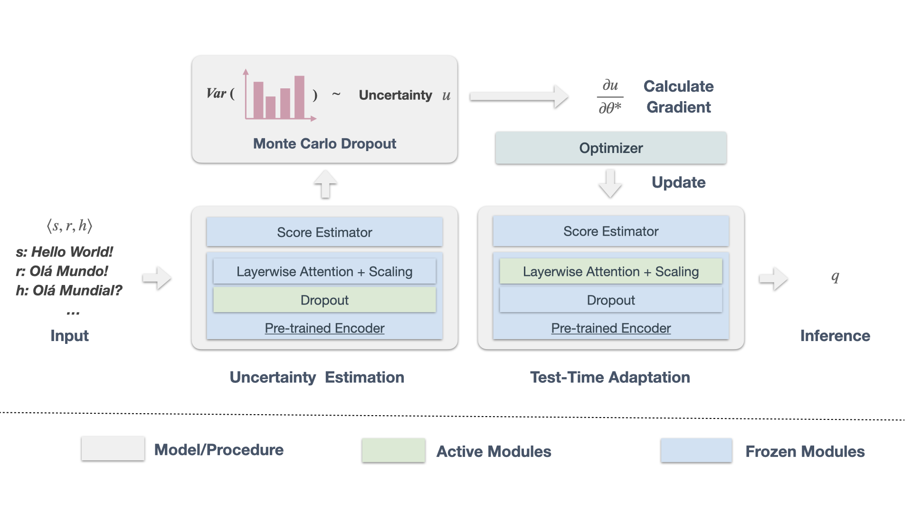

# TaU
TaU: Test-time Adaptation for Machine Translation Evaluation by Uncertainty Minimization

[Paper](https://aclanthology.org/2023.acl-long.47.pdf) [Slides](https://runzhe.me/assets/tau_acl23_oral_slides.pdf) [Poster](https://runzhe.me/assets/2023_Test-time_Adaptation_for_MT_Eval-v3.pdf)


## Overview
<p align="center">
  
</p>

## Prerequisites
This work cannot be done without the amazing code from [COMET](https://github.com/Unbabel/COMET/b) and [mt-metrics-eval](https://github.com/google-research/mt-metrics-eval/).

```bash
cd comet
pip install poetry
poetry install
```

```bash
git clone https://github.com/google-research/mt-metrics-eval.git # Our version: bdda529ce4fae9
cd mt-metrics-eval
pip install .
alias mtme='python3 -m mt_metrics_eval.mtme'
mtme --download 
```

## Test-time Adaptation
- Run with configurations
  1. Create the experiment script:
  ```bash
  cd tau/
  python create_tau_exps.py --config_file configs/{comet-da/comet-mqm/comet-qe-mqm}.yaml
  ```
  2. Run the generated script:
  ```bash
  cd tau/
  sh run_{comet-da/comet-mqm/comet-qe-mqm}.sh
  ```

- CLI Usage Example:
  ```bash
  MTME_DATA=${HOME}/.mt-metrics-eval/mt-metrics-eval-v2/
  SAVE=results
  SYSTEM=Online-W.txt
  python tau.py \
      -s ${MTME_DATA}/wmt21.tedtalks/sources/en-de.txt \
      -r ${TASK_DATA}/wmt21.tedtalks/references/en-de.refA.txt -t ${SYSTEM} \
      --to_json ${SAVE}/${SYSTEM}.json \
      --lr 1e-4 --mc_dropout 30 --component ln --adapt-epoch 1 --batch_size 16 --quiet
  ```

## Meta-evaluation
- Recommendation: Please use the "unit test" to ensure that the meta-evaluation script can produce the baseline result reported in the WMT official report. To do so, please check the following function in tau/meta_eval_results.py:":
    ```python
    def verify():
      ...
      file = "" # Please replace the path with your MTME data path
      ...
    ```
- If you use the generated script to run the experiments, you can evaluate the correlation performance with: 
    ```bash
    cd tau/
    python meta_eval_results.py [comet-da-results/wmt21.tedtalks/en-de] # An example
    ```
## Supplementary
Here is a valueable question after the publication: How do TaU perform in the low-resource languages and other benchmarks without tuning?

- We recognize and value language diversity. However, the out-of-domain benchmark for MT evaluation is scarce. Thus, we conducted further experiments on the previous WMT20-News benchmark with the same learning rate (without tuning on developmental data), and the results are as follows:
  
  |              | **Pl-En** | **Ru-En** | **Ta-En** | **Zh-En** | **En-Pl** | **En-Ru** | **En-Ta** | **En-Zh** |
  |--------------|-----------|-----------|-----------|-----------|-----------|-----------|-----------|-----------|
  | **COMET-DA** | 34.5      | 83.6      | 76.4     | 93.1      | 80.0      | 92.5      | 79.8      | 0.7       |
  | **+TaU**     | **34.6**  | **84.0**  | **77.4** | **93.4**  | 79.0      | 91.6      | 75.3      | **1.2**   |


## Environment (For reference)
* [sacreBLEU](https://github.com/mjpost/sacrebleu) version >= 1.4.14
* [PyTorch](http://pytorch.org/): 1.13.0
* [Huggingface-transformers](https://github.com/huggingface/transformers): 4.25.1
* [mt-metrics-eval](https://github.com/google-research/mt-metrics-eval): 0.0.1
* System NVIDIA Driver: 450.203.03, CUDA 11.0
* Python: 3.10.8 (w/ nvidia-cuda-runtime-cu11: 11.7.99)
* GPU: the main experiments were conducted using NVIDIA GeForce RTX 2080 Ti.

## Citation
```bibtex
@inproceedings{zhan-etal-2023-test,
    title = "Test-time Adaptation for Machine Translation Evaluation by Uncertainty Minimization",
    author = "Zhan, Runzhe  and
      Liu, Xuebo  and
      Wong, Derek F.  and
      Zhang, Cuilian  and
      Chao, Lidia S.  and
      Zhang, Min",
    booktitle = "Proceedings of the 61st Annual Meeting of the Association for Computational Linguistics (Volume 1: Long Papers)",
    month = jul,
    year = "2023",
    address = "Toronto, Canada",
    publisher = "Association for Computational Linguistics",
    url = "https://aclanthology.org/2023.acl-long.47",
    pages = "807--820",
}
```